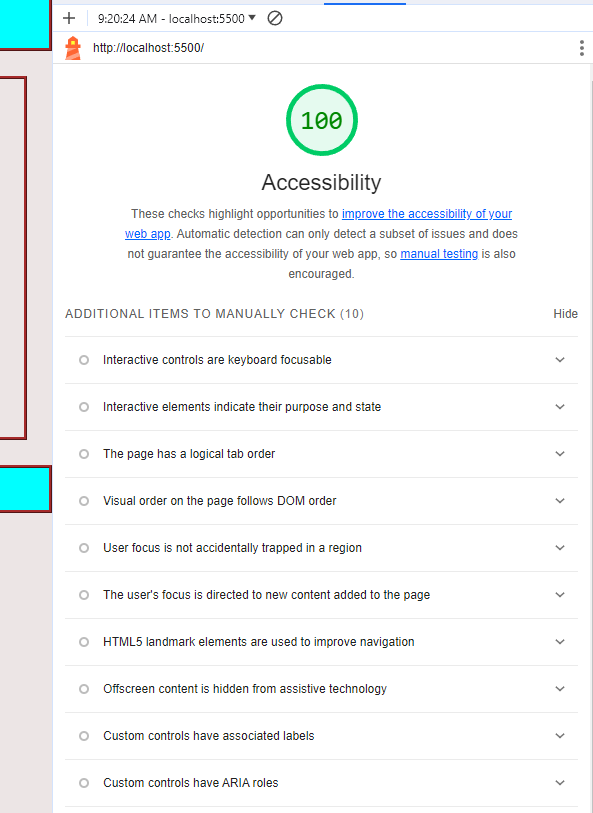

# LAB - 2

## About Me

This is the about me project, 2nd day. Adding some info about me, added more prompts, an image, and some layout changes

### Author: Christopher Acosta

### Links and Resources

### Lighthouse Accessibility Report Score

  

### Reflections and Comments

#### Reading Journal entry:

* Today was tougher than the last day. I'm having some CSS troubles. I'm not having much difficulty with the prompts and alerts but web designing with CSS is hard for me.

* External Resources: ChatGPT for the 7th prompt. It helped me write code to alert users on remaining attempts before the correct answers prompt if all attempts were used.
