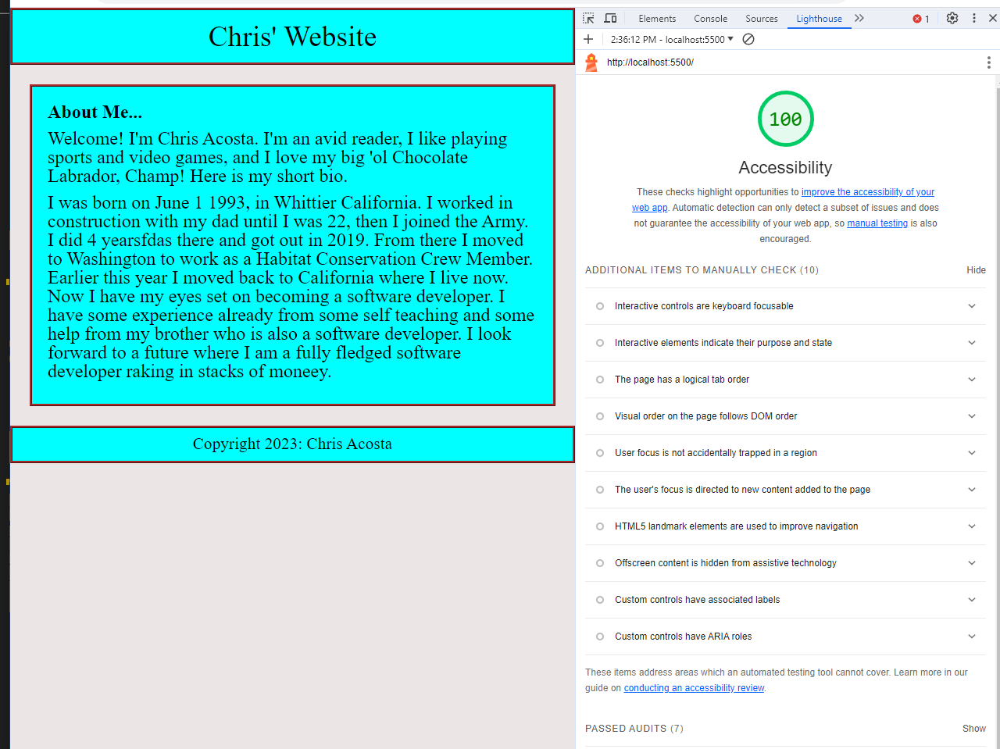

# LAB - 2

## About Me

This is the about me project, 1st day. Adding some info about me, and 5 questions

### Author: Christopher Acosta

### Links and Resources

### Lighthouse Accessibility Report Score

  

### Reflections and Comments

#### Reading Journal entry:

* Today was more of a refresher for me. I have some prior experience with HTML and JavaScript but I am no where near a professional. It felt good to come back and touch up on skills that I haven't used in a while. Web design was never one of my strengths so I definitely need more CSS practice to make my pages prettier. I did notice that including some of the files provided like the .eslint.json file, messed with my code a little bit. I guess it has some restrictions that I'm not used to seeing. For example, writing functions in my js file and then trying to invoke them in my index file lead to some errors. Other than that, the assignment went pretty smooth.

* I didn't have to use any external resources, only the lab directions.
