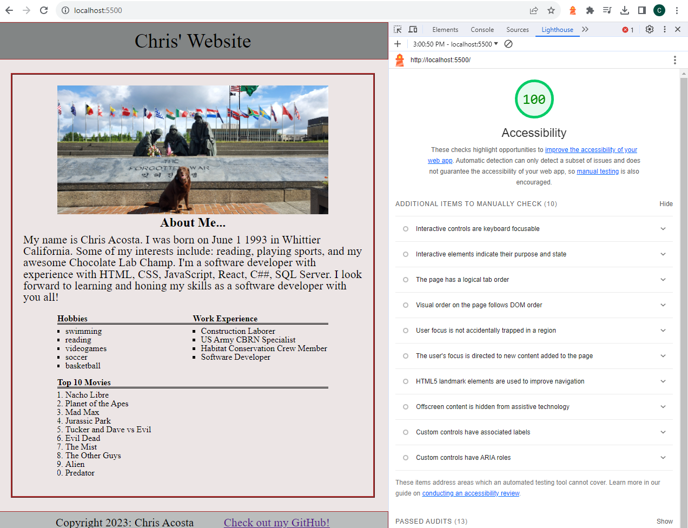

# LAB - 5b

## About Me

This is the about me project, last day. Finished the rest of the CSS issues.

### Author: Christopher Acosta

### Links and Resources

### Lighthouse Accessibility Report Score

* Lighthouse score for Lab 5!

  

### Reflections and Comments

#### Reading Journal entry:

* The lab went better today. I was still having some issues with CSS but a TA helped me straighten them out. The bullet points for my ul were getting messed up by the parent container with overflow hidden. I noticed that the reset css stylesheet was the reason my ol weren't numbered by default and putting a type on them in the index.html wasn't fixing it so I gave it a list-style-type in my css stylesheet to fix it. It is now decently presentable.

#### Notes

* I still have a lot of practicing to do with CSS!
