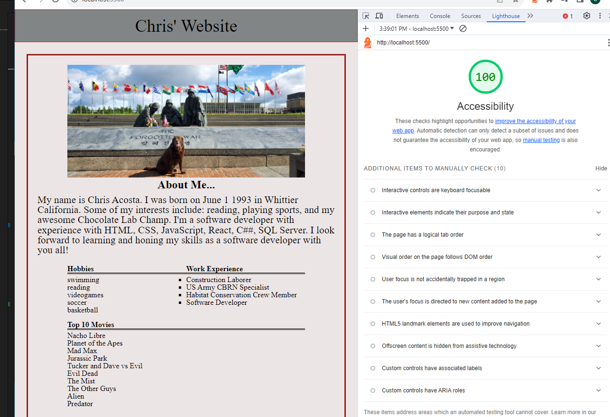

# LAB - 4

## About Me

This is the about me project, 3rd day. Added functions to js file along with my partner Kyle Aleman.

### Author: Christopher Acosta

### Links and Resources

### Lighthouse Accessibility Report Score

  

### Reflections and Comments

#### Reading Journal entry:

* Today was pretty good. It was my first introduction to partner coding. The process to do pull requests went good. I could definetely see merge conflicts be a pain, thanfully we didn't run into that. I would like to learn how to resolve merge conflicts and more on those kind of problems in case I ever run into that. The coding functions went good, no troubles.

* External Resources: My brother actually helped me come up with the function for the first 5 y/n questions that works for all of them. It made the js file a lot cleaner.
